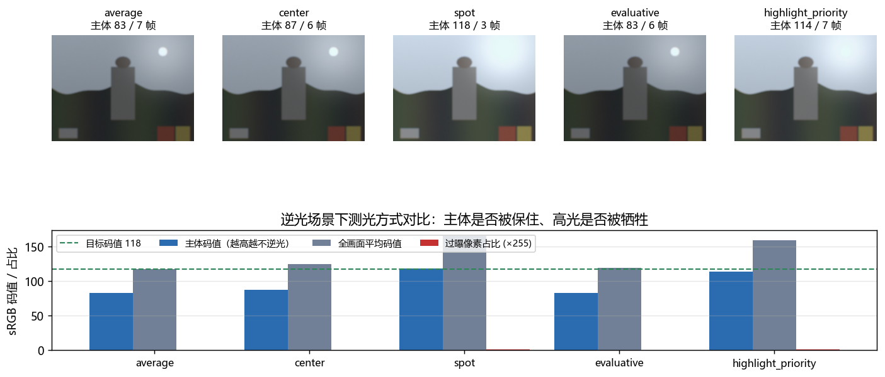
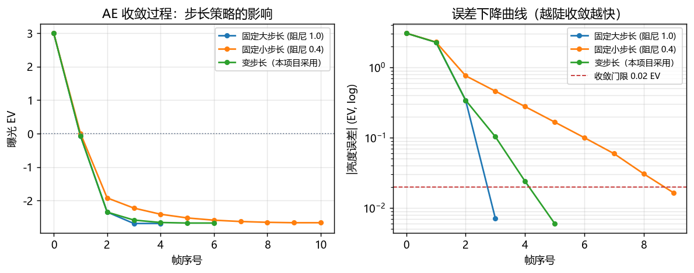
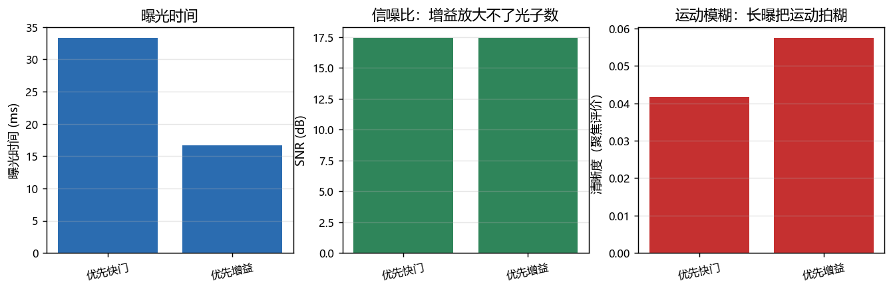
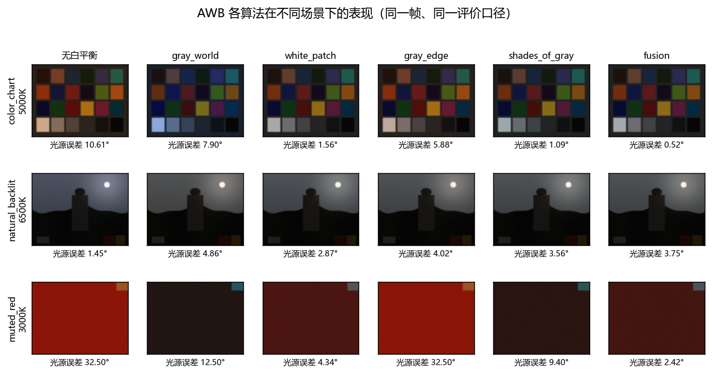
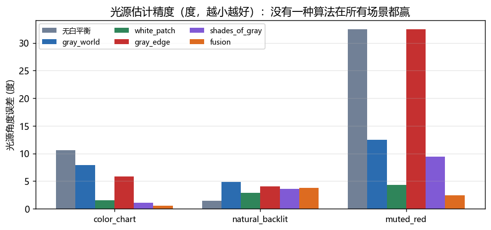

# 3A ISP Lab —— AE / AWB / AF 算法与调优实验平台

一个从**物理建模 → ISP 链路 → 3A 闭环控制 → 量化评价 → 实验报告**全流程跑通的
相机 3A 算法实验平台。所有结论都有可复现的数字，而不是"看起来很对"。

- 仿真相机：光学（离焦 PSF / 镜头阴影 / 横向色差）、传感器（满阱、光子散粒噪声、
  读出噪声、CFA 串扰、ADC 量化）、光源（黑体色温、交流纹波）
- 完整 ISP：BLC → LSC → 去马赛克（双线性 / 色差插值）→ AWB → CCM → 色调映射 → 降噪锐化
- 3A 算法：5 种测光方式 + 变步长闭环 + 标定查表；5 种 AWB 算法 + 置信度融合 + 色温先验；
  5 种对焦评价函数 + 4 种搜索策略
- 评价指标：光源角度误差、ΔE00、中性区残余色度、CCT/Duv、收敛帧数、半高宽、动态范围……

```bash
python run_all.py            # 跑完全部实验并生成报告（约 60s，约 780 次成像）
python run_all.py --fast     # 小图快速验证（约 15s）
python tests/test_aaa.py     # 21 个单元测试
```

产出：`out/report.html`（自包含，含全部图表与结论）、`out/report.pdf`、`out/report.md`、`out/results.json`


---

## 为什么用仿真而不是实拍

实拍照片**没有真值**：你不知道拍摄时的真实光源色温，也不知道镜头的理想合焦位置。
于是"AWB 准不准""对焦准不准"只能靠肉眼判断，无法量化。

仿真里光源色温、反射率、理想合焦位置都是自己设定的，因此每个指标都能给出数字：

| 要评的东西 | 评价指标 | 真值来源 |
|---|---|---|
| AWB 精度 | 光源角度误差（度）、CCT/Duv 偏差 | 设定的光源色温 |
| 颜色精度 | 色卡逐块 ΔE00 | 场景反射率 × 理想白平衡增益 |
| AE 精度 | 目标码值误差、收敛帧数、过曝比例 | 18% 中灰目标 |
| AF 精度 | 峰位误差、半高宽、动态范围 | 设定的真合焦位置 |

**理想成像结果的推导**（颜色评价的无争议基准）：
反射率 `r` × 光源 `L` × 理想白平衡增益 `(1/L，G 归一化)` = `r × L_G`，
即白平衡正确时，理想图像就是反射率本身乘一个常数。

### 仿真的边界（必须说清楚）

- 传感器 RGB 被**近似当作 sRGB 原色**处理。真实 ISP 在 sensor RGB 标定矩阵上做 AWB，
  本近似会引入固定的模型误差 —— 所以所有 ΔE 只用于**相对比较**，不作为绝对精度结论。
- 场景是程序合成的，不含真实的材质光谱、镜头像差、传感器非线性。
- 结论中"哪一类算法更好"是可迁移的；具体数值不能直接搬到真实产品上。

---

## 目录结构

```
aaa_isp_lab/
├── run_all.py                  # 实验编排：跑全部实验 → 生成报告
├── src/
│   ├── config.py               # 集中 tuning 参数表（模拟真实 ISP 的参数管理）
│   ├── color_science.py        # 色温<->色度、sRGB/XYZ/Lab、普朗克轨迹、Duv、CIEDE2000 前置
│   ├── sim/
│   │   ├── scene.py            # 合成场景（色卡 / 对焦标板 / 逆光人像 / 单色 / 匀光板）
│   │   ├── optics.py           # 抗锯齿离焦 PSF、运动模糊、镜头阴影、横向色差
│   │   ├── sensor.py           # 光电转换、散粒/读出噪声、CFA 采样、量化
│   │   └── camera.py           # 曝光分配、闪烁带纹、EV 范围约束、成像入口
│   ├── isp/
│   │   ├── modules.py          # BLC / LSC / 去马赛克 / WB / CCM / 色调映射 / 降噪锐化
│   │   └── pipeline.py         # 管线编排，同时输出多个"域"供 3A 各自使用
│   ├── aaa/
│   │   ├── ae.py               # 测光 + 变步长闭环 + 标定查表
│   │   ├── awb.py              # 5 种估计器 + 置信度融合 + 色温先验约束
│   │   └── af.py               # 5 种评价函数 + 4 种搜索策略 + 四性分析
│   └── eval/
│       ├── metrics.py          # PSNR/SSIM/ΔE00/中性色度
│       └── report.py           # 图表与报告生成
└── tests/test_aaa.py           # 21 个单元测试（含 CIEDE2000 官方测试数据）
```

---

## 实验结果摘要

完整结论与图表见 `out/report.html`。以下是关键数字：

### AE 测光（逆光：大面积亮背景 + 正中主体）

| 测光方式 | 帧数 | 最终 EV | 主体码值 | 过曝比例 |
|---|---|---|---|---|
| 全画面平均 | 7 | -2.72 | 83 | 0.00% |
| 中心加权 | 6 | -2.55 | 87 | 0.03% |
| 点测光 | 3 | -1.63 | 118 | 0.48% |
| 分区评价 | 6 | -2.68 | 83 | 0.00% |
| 高光优先(99分位) | 7 | -1.75 | 114 | 0.43% |

五种方式**全部正常收敛**，主体码值却相差 35 —— "AE 准不准"这个问法本身是错的，
先要问测的是什么。





### AE 执行器分配（低照度）

| 策略 | 曝光时间 | 增益 | SNR | 清晰度 |
|---|---|---|---|---|
| 优先快门 | 33.3 ms | 1.89× | 17.44 dB | 0.042 |
| 优先增益 | 16.7 ms | 3.79× | 17.43 dB | 0.058 |

**增益放大的是同一份光子噪声，SNR 几乎不变**；换来的只是更短的曝光和更少的运动模糊。




### AWB（光源角度误差，度）

| 场景 | 无白平衡 | 灰世界 | 白块 | 灰边 | SoG | 融合 |
|---|---|---|---|---|---|---|
| 色卡 5000K | 10.61 | 7.90 | 1.56 | 5.88 | 1.09 | **0.52** |
| 逆光 6500K | 1.45 | **4.86** | 2.87 | 4.02 | 3.56 | 3.75 |
| 单色 3000K | 32.50 | 12.50 | 4.34 | 32.50 | 9.40 | **2.42** |

同一套算法在不同场景下的排名**完全颠倒**，没有一种算法在所有场景都赢。





### 色温先验：只治色温，不治 Duv

| 场景 | 真值 | 约束前 | Duv | 误差 | 约束后 | 误差 |
|---|---|---|---|---|---|---|
| 红色主导 | 3000K | 1688K | -0.0130 | 17.16° | 1986K | **12.50°** |
| 蓝色主导 | 3000K | 7172K | +0.0077 | 36.59° | 7172K | 36.59° |
| 标准色卡 | 5000K | 4194K | -0.0005 | 7.89° | 4194K | 7.89° |

三个场景只有**一个**触发了约束；误差最大的那一个（36.6°）估计色温"看着很正常"，
错误全在 Duv 方向上 —— **把色温范围钳位当作保护措施，实际几乎不起作用**。


### 对焦评价函数

| 函数 | 峰位误差 | 半高宽 | 动态范围 | 峰位抖动σ |
|---|---|---|---|---|
| Brenner | 0.025 | 0.20 | 18.5 dB | 0.030 |
| Tenengrad | 0.050 | 0.15 | 15.0 dB | 0.041 |
| 拉普拉斯方差 | 0.050 | 0.15 | **31.6 dB** | 0.037 |
| SML | 0.025 | 0.20 | 15.3 dB | **0.019** |
| FFT 高频占比 | 0.050 | 0.45 | **2.6 dB** | 0.032 |

FFT 高频占比看起来最"优雅"，动态范围只有 2.6 dB —— 几乎没有分辨能力。


### 搜索策略

| 策略 | 帧数 | 定位误差 |
|---|---|---|
| 全扫描 | 21 | 0.050 |
| 爬山 | **6** | 0.070 |
| 粗到细 | 15 | **0.000** |
| 黄金分割 | 14 | 0.032 |

黄金分割在严格单峰函数上理论最优，实测输给粗到细 —— 它一旦被假峰误导，
就会被**永久关在错误的区间里**（区间收缩不可逆）。理论最优 ≠ 工程可用。


### 3A 耦合：三者不是独立的三个模块

欠曝到 -3 EV 以下 AWB 直接完全失效（误差 0.69° → 10.61°）；过曝时对焦评价函数的
动态范围从 15.0 dB 塌到 7.5 dB。**欠曝主要伤 AWB，过曝主要伤 AF。**


---

## 实现过程中踩到并修掉的坑

这一节是这份工程里最值钱的部分。**每一个坑的共同点都是"程序不报错、结果看起来合理"**，
只有对物理量和算法性质有预期，才能发现。

1. **曝光归一化搞错**：`电子数 = 辐射亮度 × 曝光时间(秒) × 满阱` 混用了绝对时间与归一化
   亮度，整条链路暗了 60 倍，AE / AWB / AF 全部崩溃（表现为"AWB 各种算法结果完全一样"，
   因为有效像素掩码被全部排除，都走了兜底分支）。正确写法是显式的**相对曝光因子**，
   使得 `exposure_factor = 1` 时线性域数值等于物理辐射亮度。

2. **AE 的 EV 范围必须与硬件一致**：控制器输出范围写成 ±8 EV，而该传感器最多给到
   +5 EV —— 控制器一路推到 +8 EV 却永远到不了目标，表现为"不收敛"。现在
   `ev_limits()` 从传感器参数反算范围，AE 直接用。

3. **离焦 PSF 的亚像素量化**：按"像素中心在圆内"生成圆盘核，半径 < 1 px 时核退化成
   delta，图像**完全不变**。结果是评价函数在一大段镜头位置上水平、峰位随机落在
   行程中点 0.50（真值 0.35）。改成按覆盖面积做抗锯齿（子采样）后峰位才正确。

4. **饱和时 AE 的误差被压缩到接近 0**：像素顶到 1.0 后亮度不再随曝光增加，
   哪怕过曝 2 档，99 分位也只给 1.0，算出的误差被压到 -0.15 EV —— **越曝越看不出来**。
   实测 12 帧仍未收敛、55% 像素过曝。解法是改用与亮度无关的"过曝像素比例"给出步长下限。

5. **带纹指标被 Bayer 行交替污染**：直接对 RAW 求行均值，奇偶行颜色组合不同
   （R+G 与 G+B），凭空多出一个巨大且恒定的"带纹"。必须在去马赛克后的亮度图上测。

6. **带纹指标的去趋势窗口太小**：纹波在画面上只有 2~3 个周期，用 `rows/8` 的中值窗
   去趋势会把**真实带纹一起滤掉**，测出来只剩真实值的百分之几。改用二次多项式去趋势 +
   只在已知纹波频点上取幅度，实测"关抗闪烁 0.147 / 开抗闪烁 0.0001"，相差千倍。

7. **测试场景选错会得出伪结论**：用色卡测带纹 → 场景自身的行结构被当成带纹 →
   得出"开抗闪烁反而更差"的错误结论。测试场景必须**行轮廓平坦**（匀光板），
   这也是产线上的实际做法。同理，均匀度必须在匀光板上测色卡上测的是画面内容。

8. **测试场景的构图决定能不能测出差异**：测光方式的对比里，主体原来占画面 30%，
   结果五种测光方式几乎没差别（都被"顺便"保住了）。改成主体占 8%、亮背景占 55%
   之后差异才显现。

9. **光照充足时看不出快门/增益策略的差异**：EV<0 时增益被钳在 1.0，两种策略结果完全一样。
   必须把场景调暗 12 倍（约 3.6 档）让 EV>0 才测得出。

10. **仿真里不加光谱串扰，颜色题就是假题**：传感器通道恰好等于场景反射率时，
    CCM 退化成单位阵，"白平衡 + CCM 的贡献拆解""AWB/CCM 耦合"全都变成自欺欺人。
    加上真实存在的 CFA 串扰后，标定出的 CCM 才带负交叉项。

11. **`_to_u8` 的 dtype 陷阱**：`np.asarray(img, np.float32)` 之后再判 `dtype == uint8`
    永远为假，uint8 图被乘两次 255 → 整幅图全白。图"看起来是空的"，程序不报错。

12. **结论必须由数据支持，不能反过来**：最初想用"AF 帧数随曝光变化"讲 3A 耦合，
    实测帧数由搜索策略决定、与曝光无关 —— 于是改成评"评价函数动态范围"。
    报告里每一条结论都对应一组实测数字，对不上的地方就改结论，不改数据。

---

## 已知不足与可以继续做的方向

- **没有真实相机验证**：仿真结论需要一条真机链路做交叉验证
  （用 OpenCV 手动控制真实摄像头的曝光/增益/白平衡，复现几个关键结论）
- **3A 时域滤波**：当前是逐帧独立收敛，真实产品需要时域平滑与场景切换检测
- **更完整的 AWB**：色域（gamut）约束、按场景分类分支、时序先验
- **AF 只做了 CDAF**：相位检测 AF（PDAF）的双像素模型、混合对焦策略
- **色调映射过于简单**：只有全局曲线 + 肩部压缩，没有局部色调映射与 HDR 融合
- **没有做端侧量化/性能**：3A 在芯片上的算力预算与定点化是另一个大话题

---

## 环境

Python 3.8+，依赖 `numpy`、`opencv-python`、`scipy`、`matplotlib`。
（开发环境为 Python 3.10 + numpy 1.26 + opencv 4.9 + scipy 1.13 + matplotlib 3.8）

```bash
pip install -r requirements.txt
```

> 提示：需要中文字体（Windows 自带 Microsoft YaHei，Linux 需安装 SimHei 或
> Noto Sans CJK），否则图表里的中文会显示成方块。
