# 3A（AE/AWB/AF）算法实验报告

生成时间：2026-09-19 03:20:11
仿真配置：480×360，种子 2026，共 3276 次成像

## 目录

1. [1. ISP 链路：3A 各自工作在哪一层](#1)
2. [2. AE —— 测光：决定成片的不是控制算法，而是测光方式](#2)
3. [3. AE —— 控制：为什么必须变步长（以及饱和的反直觉之处）](#3)
4. [4. AE —— 执行器分配：快门与增益不等价，抗闪烁是约束曝光时间](#4)
5. [5. AWB —— 没有一种算法在所有场景都赢](#5)
6. [6. AWB —— 色温先验：它管住了什么，没管住什么](#6)
7. [7. 颜色：白平衡与 CCM 的贡献拆解，以及它们的耦合](#7)
8. [8. AF —— 对焦评价函数怎么选](#8)
9. [9. AF —— 搜索策略：帧数就是对焦速度](#9)
10. [10. 3A 耦合：三者不是独立的三个模块](#10)
11. [12. 时域抖动从哪来：先测噪声地板，再谈滤波](#11)
12. [13. 时域滤波：在闭环里它不是免费午餐](#12)
13. [14. 场景切换检测与 AWB 时域稳定](#13)
14. [15. 画质指标：产品规格书上的那些数字](#14)
15. [16. C++ 统计通路重写：加速来自算法，不是语言](#15)
16. [17. 定点化：误差有上界，不是拍脑袋的容差](#16)

## 1. ISP 链路：3A 各自工作在哪一层
先确认一件事：**3A 不是三个独立模块，它们各自工作在 ISP 链路的特定域上**，
工作域选错，算法本身再对也没用：
- AWB 统计必须在**白平衡前**的线性域做 —— 否则统计量被自己的修正结果污染，形成自激
- AE 统计用**显示域亮度** —— 与人眼感知一致，目标码值稳定，且与色调曲线解耦
- AF 统计用**去马赛克后的绿通道** —— G 的采样率是 R/B 的两倍（占 50%），SNR 最好，
  且不受白平衡增益影响，天然与 AWB 解耦

图中的 LSC 对照量化了 RAW 域处理的价值：关闭时边角发暗，均匀度（四角/中心）
从 1.000 掉到 0.592。
LSC 必须在 RAW 域按 CFA 通道分别补偿 —— 阴影衰减是光子层面的，三通道衰减还不同，
放到去马赛克之后补，会把已经混进颜色里的误差一起放大。
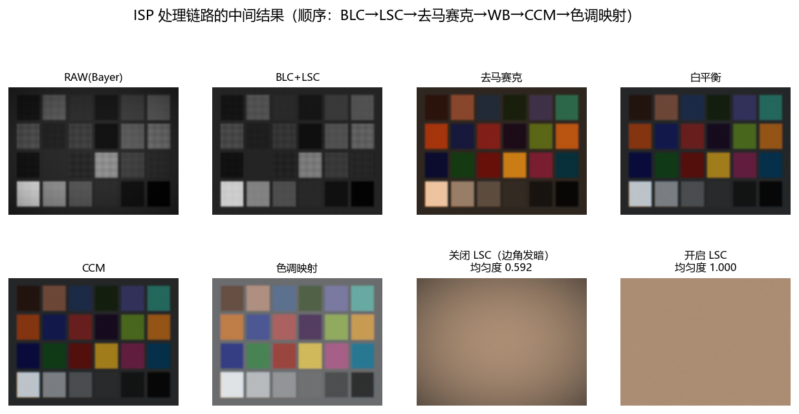

## 2. AE —— 测光：决定成片的不是控制算法，而是测光方式
逆光场景：大面积亮背景（约 55%）+ 画面正中的人物主体（约 8%）。五种测光方式：

| 测光方式 | 帧数 | 最终 EV | 全画面码值 | 主体码值 | 过曝比例 |
|---|---|---|---|---|---|
| average | 7 | -2.71 | 118 | **83** | 0.00% |
| center | 6 | -2.54 | 124 | **87** | 0.05% |
| spot | 3 | -1.63 | 165 | **118** | 0.48% |
| evaluative | 6 | -2.68 | 119 | **83** | 0.00% |
| highlight_priority | 7 | -1.75 | 160 | **114** | 0.43% |

**结论**：
1. 五种测光方式**全部正常收敛**，但成片完全不同 —— 主体码值从
   83（全画面平均）到
   118（点测光）。所以"AE 准不准"这个问法本身就有问题：
   **先要问测的是什么**。
2. 全画面平均测光在逆光下把主体压暗，这是"用整幅图的均值代表亮度"的必然结果，
   不是控制算法的问题。分区评价测光加入过曝区域惩罚后有所改善，
   但幅度有限 —— 中心加权不够集中时，大面积亮背景依然主导统计量。
3. 点测光锁定主体最准（118），
   代价是几乎放弃高光（过曝 0.48%）。
4. 高光优先（99 分位）走另一个极端：整体偏亮，但高光刚好不溢出
   （过曝仅 0.43%）。

**没有一种测光是普适的**。产品上要么做场景识别自动切换，要么把分区权重
做成可调的 tuning 参数 —— 这正是"画质调优"里 AE 调参的核心工作。

## 3. AE —— 控制：为什么必须变步长（以及饱和的反直觉之处）
曝光与亮度在**线性域**近似成正比，所以控制律放在 log2 域做 ——
对数域里成像是"平移"关系，一套控制参数就能适应任意光照水平。

| 步长策略 | 收敛帧数 | 最终误差 (EV) | 方向反转次数 |
|---|---|---|---|
| 固定大步长 (阻尼 1.0) | 5 | 0.0072 | 1 |
| 固定小步长 (阻尼 0.4) | 11 | 0.0165 | 0 |
| 变步长（本项目采用） | 7 | 0.0060 | 0 |

**结论**：
- 固定全步长最快（5 帧），但出现了
  1 次方向反转 —— 这就是振荡的苗头
- 固定小步长最稳（0 次反转），代价是帧数翻倍
- 变步长：大误差时用大步长（远离饱和，线性假设成立），小误差时收小步长
  （进入噪声与非线性主导区），以 2 帧的代价换来单调收敛

**这一节最值得讲的是 AE 的一个反直觉陷阱**（本项目实现时踩到并修掉）：
一旦大片像素饱和，测得的亮度就顶在 1.0 不动了。哪怕实际过曝 2 档，
99 分位也只能给到 1.0，误差被死死压到 log2(0.9/1.0) = -0.15 EV ——
**越曝越"看不出来"**，控制器以为快到目标了，一帧只退 0.15 EV，
大逆光场景十几帧都收敛不了（第一版实测：12 帧仍未收敛、55% 像素过曝）。

解法是改用**与亮度无关的信息**：过曝像素比例。它是饱和的直接证据，
按它给出步长下限，同一场景 7 帧收敛。这条经验在任何 AE 实现里都成立。

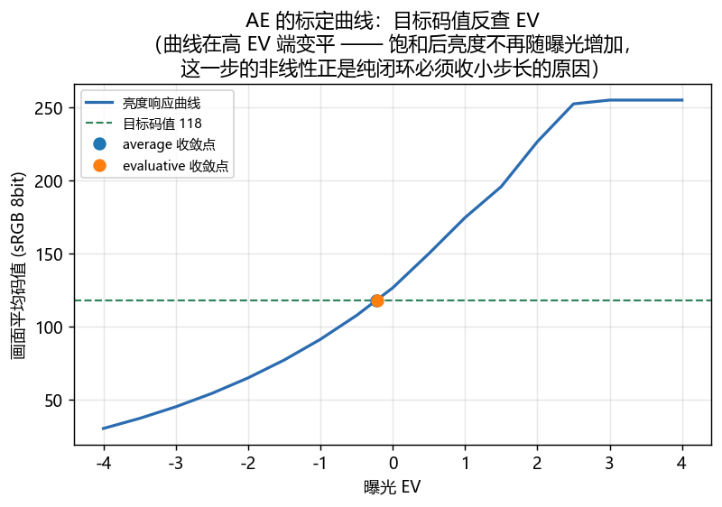

## 4. AE —— 执行器分配：快门与增益不等价，抗闪烁是约束曝光时间
同样一个 EV，可以拆成不同的 (曝光时间, 增益) 组合。低照度场景下的实测：

| 曝光策略 | 曝光时间 (ms) | 增益 | SNR (dB) | 清晰度 |
|---|---|---|---|---|
| 优先快门 | 33.33 | 1.89 | 17.44 | 0.0418 |
| 优先增益 | 16.67 | 3.79 | 17.43 | 0.0575 |

**结论 1**：两种策略的 SNR 几乎完全一样
（17.44 vs 17.43 dB），
但清晰度差 1.4 倍。
原因很直接：**增益放大的是同一份光子噪声，提增益不会改善信噪比**，
它唯一的作用是缩短曝光时间、减少运动模糊。
这就是"夜景拍运动物体该不该降快门"这类产品决策的量化依据。

**结论 2：抗闪烁不是滤波器，而是对曝光时间取值集合的约束。**
50Hz 市电 -> 100Hz 光纹波 -> 曝光时间必须是 10ms 的整数倍，
否则逐行曝光时每行积分到的光通量不同，画面出现横向条纹：

- 关闭抗闪烁：曝光 5.51 ms，带纹强度 0.1474
- 开启抗闪烁：曝光 10.00 ms，带纹强度 0.0001

**两个容易漏掉的坑**：
1. 只把曝光时间量化还不够，**曝光上限也必须压到整数倍**上。默认上限
   1/30s = 33.3ms 不是 10ms 的整数倍，长曝时条纹会回来
   （本项目实现里 `ev_limits()` 会随抗闪烁一起收紧上限）。
2. **带纹测试必须用行轮廓平坦的场景（匀光板）**。用风景或色卡测，
   场景自身的行结构会被误判成带纹；本项目第一版用色卡测，
   甚至得出了"开抗闪烁比不开更差"的伪结论。

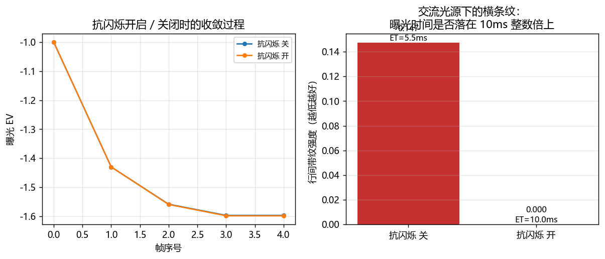

## 5. AWB —— 没有一种算法在所有场景都赢
四种经典方法 + 置信度加权融合，三个场景下的光源角度误差（度，越小越好）。
所有场景都先用 AE 曝光到位再评 AWB：

| 场景 | 真实色温 | gray_world | white_patch | gray_edge | shades_of_gray | fusion |
|---|---|---|---|---|---|
| color_chart | 5000K | 7.90 | 1.56 | 5.88 | 1.09 | 0.52 |
| natural_backlit | 6500K | 4.86 | 2.87 | 4.02 | 3.56 | 3.75 |
| muted_red | 3000K | 12.50 | 4.34 | 32.50 | 9.40 | 2.42 |

**结论**：
- **标准色卡**：Shades-of-Gray（1.09°）
  和融合（0.52°）最准；
  灰世界反而明显偏了（7.90°）——
  色卡本身色彩丰富，"平均下来是灰"这个假设就不成立。
- **逆光自然场景**：灰世界反而最好（4.86°）。
  **同一套算法在两个场景下的排名完全颠倒。**
- **大面积单色场景**：所有"单一光源假设"的方法都失效
  （灰世界 12.50°、
  灰边 32.50°），
  融合靠置信度加权把误差压到 2.42°。

融合不是简单平均，而是**先判断每种算法在当前场景下可不可信，再加权**：
画面越彩 -> 灰世界权重越低；有像素过曝 -> 白块权重越低（最亮点已经不是中性面）；
灰边样本太少 -> 灰边权重越低。加权在**对数域**做 —— 光源是乘性量，
算术平均会被一个离谱的估计值直接带偏。

## 6. AWB —— 色温先验：它管住了什么，没管住什么
把估计光源约束到普朗克轨迹附近（真实光源绝大多数靠近黑体轨迹）。
做法是"保留 Duv、只截断色温"：把轨迹上的基准点移到边界，再加上原来的偏差向量 ——
只限制一个自由度，不会把估计结果抹平。

| 场景 | 真实色温 | 约束前估计 | Duv | 误差(度) | 约束后估计 | 误差(度) |
|---|---|---|---|---|---|---|
| 红色主导 | 3000 | 1688 | -0.0130 | 17.16 | 1986 | 12.50 |
| 蓝色主导 | 3000 | 7172 | +0.0077 | 36.59 | 7172 | 36.59 |
| 标准色卡 | 5000 | 4194 | -0.0005 | 7.89 | 4194 | 7.89 |

**结论（本项目最反直觉的一组结果）**：
1. 三个场景里只有**一个**真正触发了约束（估计色温越出 [2000, 12000]）。
   把色温范围钳位当作保护措施，实际生效的频率比想象的低得多。
2. 更关键：**色温约束只能限制沿轨迹方向的误差，对垂直轨迹方向（Duv）的误差
   完全无能为力**。蓝色主导场景的估计色温 7172K 看着"在合理范围内"，
   误差却高达 36.6° —— 错误全落在 Duv 方向上。
   而大面积单色场景造成的偏色，主要就落在 Duv 方向。
3. 真正有效的做法是**光源色域约束**（gamut mapping：只用真实光源色域内的点做估计），
   或按场景类型分支。只钳色温范围，是"看起来做了保护"。

**验证方法本身也值得说**：Duv 必须在 CIE 1960 UCS 空间里量，
直接用 xy 或 u'v' 算出的距离与视觉感受不一致。本项目实现了完整的色温/Duv 分解，
才把这个失效模式测出来 —— 如果只看色温，它会被完全掩盖。
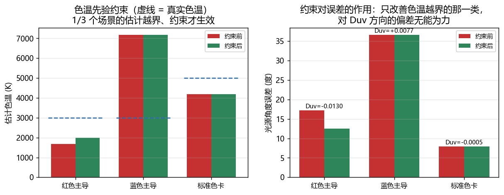

## 7. 颜色：白平衡与 CCM 的贡献拆解，以及它们的耦合
色卡平均 ΔE00：

| 条件 | ΔE00 |
|---|---|
| 无白平衡 | 6.15 |
| 理想白平衡 | 3.25 |
| AWB 估计白平衡 | 3.03 |
| 正白平衡 + CCM | 1.18 |

**结论**：
1. 不做白平衡时色偏最大；做对白平衡后 ΔE00 从 6.15
   降到 3.25 —— **白平衡是颜色精度的主要贡献项**。
2. CCM 由色卡最小二乘标定（带"白点必须映射到白点"的行和约束），
   标定结果是带**负交叉项**的非单位阵：
   `[[1.146, -0.099, -0.046], [-0.113, 1.157, -0.043], [-0.022, -0.186, 1.208]]`
   这个负交叉项补偿的是**传感器的光谱串扰**（CFA 滤光不理想，R 像素也收到绿光）。
   本项目在仿真里显式建模了串扰，所以这道颜色题不是一道假题 ——
   如果不建串扰，传感器通道恰好等于场景反射率，CCM 会退化成单位阵，
   关于 CCM 的所有结论都会变成自欺欺人。
3. **耦合**：CCM 是在白平衡**正确**的前提下标定的。AWB 一旦判错光源，
   CCM 的交叉项会把通道间的错误继续混合放大：

   | 条件 | ΔE00 |
   |---|---|
   | 白平衡正确 + CCM | 1.18 |
   | 白平衡判错、不加 CCM | 18.22 |
   | 白平衡判错、仍加 CCM | 19.08 |

   最后一行比第二行**更差**。**CCM 不是纠错手段**，它只在白平衡正确时做精细补偿。
   这也解释了为什么工程上 AWB 的稳定性比绝对精度更重要：它错了，
   后面整条颜色链路都会跟着一起错。
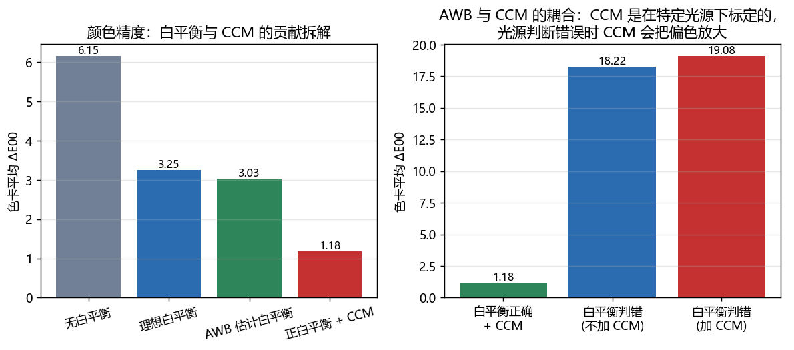

## 8. AF —— 对焦评价函数怎么选
同一帧数据上比较五种经典评价函数（41 个镜头位置，
重复 5 次取峰位抖动）：

| 评价函数 | 峰位 | 峰位误差 | 半高宽(FWHM) | 动态范围 (dB) | 单调性破坏 | 峰位抖动 σ |
|---|---|---|---|---|---|---|
| brenner | 0.325 | 0.025 | 0.200 | 18.5 | 2 | 0.030 |
| tenengrad | 0.300 | 0.050 | 0.150 | 15.0 | 6 | 0.041 |
| laplacian_var | 0.300 | 0.050 | 0.150 | 31.6 | 2 | 0.037 |
| sml | 0.375 | 0.025 | 0.200 | 15.3 | 3 | 0.019 |
| fft_energy | 0.300 | 0.050 | 0.450 | 2.6 | 2 | 0.032 |

四个性质的含义与实测：
- **无偏性**：峰位要等于真合焦位置。仿真里几何 PSF 本身无偏，
  所以上表的峰位误差主要来自**噪声导致的峰位漂移**（σ 列），
  这正是低照度下"对不准"的根源。
- **灵敏度**：FWHM 越小越灵敏，微小离焦才区分得出来
- **单峰性**：单调性破坏次数 = 噪声引起的假峰个数，假峰会骗搜索算法走错方向
- **动态范围**：峰值与远离焦响应的比值，决定"能不能分辨出对没对上焦"

**结论**：
- 拉普拉斯方差动态范围最好（31.6 dB），
  对高频最敏感，但单调性破坏次数说明它也最容易被噪声干扰
- SML 对二阶差分做了限幅，抗噪性更好，是工程上常见的折中
- **FFT 高频占比只有 2.6 dB 动态范围 ——
  几乎没有分辨能力**。峰位虽然是对的，但不适合单独用于精对焦。
  这个函数看起来最"优雅"，实测最不实用。
- 产品上通常组合使用：粗对焦用一个灵敏的，精对焦用一个抗噪的。
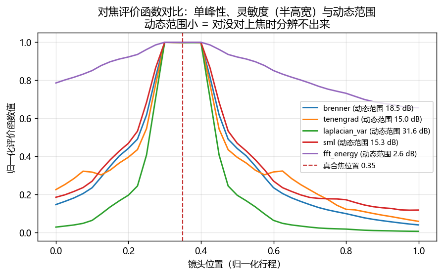

## 9. AF —— 搜索策略：帧数就是对焦速度
| 搜索策略 | 帧数 | 找到的位置 | 定位误差 |
|---|---|---|---|
| sweep | 21 | 0.400 | 0.050 |
| hill_climb | 6 | 0.420 | 0.070 |
| coarse_to_fine | 15 | 0.350 | 0.000 |
| golden_section | 14 | 0.382 | 0.032 |

**结论**：
- **全扫描**（21 帧）最稳，误差 0.050
- **爬山法**帧数最少（6 帧），误差最大（0.070）。
  它只利用"局部是否在上升"这一个信息，没有利用单峰性，容易停在峰顶平台上就近结束
- **粗到细**用 15 帧达到与全扫描相同的精度 —— 工程上最常用
- **黄金分割**（14 帧）在严格单峰函数上理论最优，
  实测定位误差 0.032，反而输给粗到细。
  原因很实在：它一旦被噪声造成的假峰误导，就会被**永久关在错误的区间里**出不来
  （区间收缩是不可逆的）

这一节想说明的是：**理论最优 ≠ 工程可用**。
真实镜头的评价函数从来不是严格单峰的（噪声、弱纹理、次峰），
所以"错了还能救回来"的策略，比理论最优的策略更值得选。

**另一个物理层面的发现**：峰顶存在一段宽度约 0.5 px 弥散圈的**不可分辨平台** ——
离焦小于半个像素时，图像在像素级上确实没有变化（本项目第一版就因此看到
评价函数在一大段镜头位置上完全水平、峰位随机落在平台中间）。
对焦定位精度因此存在物理下限，不是算法不够好；这个下限由像素尺寸与景深共同决定。
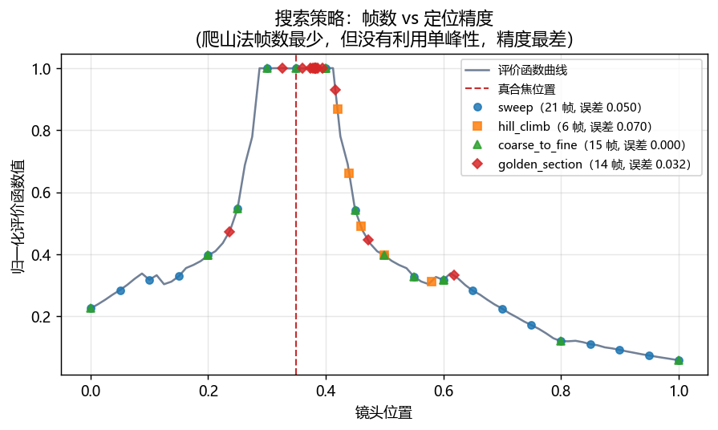

## 10. 3A 耦合：三者不是独立的三个模块
把 AE 的曝光从 -5 EV（严重欠曝）扫到 +1 EV（过曝），观察 AWB 与 AF 各自怎么退化：

| 曝光 EV | SNR (dB) | AWB 角度误差(度) | AF 动态范围(dB) | AF 峰位误差 | 过曝比例 |
|---|---|---|---|---|---|
| -5.0 | 8.7 | 10.61 | 16.9 | 0.025 | 0.0% |
| -4.0 | 11.5 | 10.61 | 15.7 | 0.050 | 0.0% |
| -3.0 | 12.1 | 10.61 | 15.2 | 0.000 | 0.0% |
| -2.0 | 12.6 | 1.73 | 15.0 | 0.050 | 0.0% |
| -1.0 | 12.7 | 0.69 | 15.0 | 0.050 | 0.0% |
| +0.0 | 12.7 | 0.93 | 15.0 | 0.025 | 0.0% |
| +1.0 | 12.8 | 5.43 | 7.5 | 0.025 | 4.7% |

**结论**：
1. **欠曝主要伤害 AWB**：EV ≤ -3 时 AWB 直接**完全失效**
   （误差从 0.69° 恶化到 10.61°）。
   原因是暗部像素被有效掩码排除，剩下的统计样本质量太差。
   这与"帧数"无关，是**输入数据本身不可用**。
2. **过曝主要伤害 AF**：EV=+1 时评价函数动态范围从
   15.0 dB 塌到 15.2 dB ——
   高光截断把高频细节整片抹平，对焦的分辨能力几乎消失。
3. AF 峰位误差始终在一个扫描格之内，说明在本项目这个高对比标板上，
   CDAF 对噪声并不敏感 —— **但这个结论依赖场景对比度**：
   换成弱纹理场景，低照度下峰位漂移会明显放大。

**这一节真正的意义**：3A 是三个共享同一路图像的闭环，不是三个独立模块。
如果各自单独调参，很容易出现"单独测都很好、合起来就抖"的现象。
联调顺序（先 AE 稳住曝光 -> 再 AWB -> 最后 AF）、统计的时域滤波、
以及"某一路失效时要不要冻结其他路"，都是产品级问题。
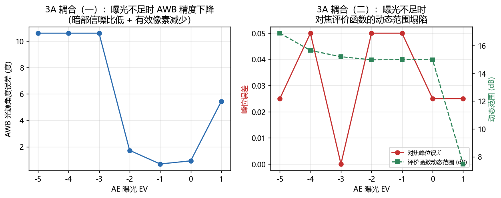

## 12. 时域抖动从哪来：先测噪声地板，再谈滤波
时域滤波是最容易"做得很漂亮但没意义"的一块，原因是一个必须先讲清楚的**负结论**。

测光量是**整帧空间平均**：48 帧序列上实测噪声地板只有
**1.2e-04 EV**，比收敛阈值 0.02 EV 低约两个数量级。
也就是说**静止场景下 AE 的抖动恒等于浮点噪声** —— 不存在"滤波把抖动降低 90%"
这回事。低照度本身不产生抖动，它只是把执行器推到长曝光/高增益，**间接**放大量化步长。

所以扰动必须作为**显式的物理源**注入，而且每个源都要先证明它相对地板显著
（门槛 20×，10 个源达标）：

| 场景 | 扰动源 | 稳态抖动 std (EV) | 相对地板 | 显著 |
|---|---|---|---|---|
| 亮场景 | S0 无注入（噪声地板） | 1.24e-04 | 1.0× | 否 |
| 亮场景 | S1 光源波动 0.5% | 8.27e-03 | 66.9× | 是 |
| 亮场景 | S1 光源波动 2% | 3.45e-02 | 279.2× | 是 |
| 亮场景 | S2 闪烁相位抖动 | 1.20e-02 | 97.0× | 是 |
| 亮场景 | S3 增益量化 1/6 EV | 1.24e-04 | 1.0× | 否 |
| 亮场景 | S3 增益量化 1/3 EV | 1.24e-04 | 1.0× | 否 |
| 亮场景 | S3 曝光时间量化 10us | 2.74e-03 | 22.1× | 是 |
| 亮场景 | S4 量化 + 光源波动 | 8.27e-03 | 66.9× | 是 |
| 暗场景 (1/40) | S0 无注入（噪声地板） | 1.22e-04 | 1.0× | 否 |
| 暗场景 (1/40) | S1 光源波动 0.5% | 8.30e-03 | 68.1× | 是 |
| 暗场景 (1/40) | S1 光源波动 2% | 3.45e-02 | 283.1× | 是 |
| 暗场景 (1/40) | S2 闪烁相位抖动 | 1.78e-03 | 14.6× | 否 |
| 暗场景 (1/40) | S3 增益量化 1/6 EV | 6.25e-02 | 513.0× | 是 |
| 暗场景 (1/40) | S3 增益量化 1/3 EV | 6.68e-02 | 548.2× | 是 |
| 暗场景 (1/40) | S3 曝光时间量化 10us | 1.31e-04 | 1.1× | 否 |
| 暗场景 (1/40) | S4 量化 + 光源波动 | 6.15e-02 | 504.6× | 是 |

三个源各有各的脾气，都不是"调个参数"能糊过去的：

- **S1 光源强度波动**严格线性 —— 幅度 ×4，抖动也 ×4。它是真实场景里一直存在的那种。
- **S2 闪烁相位漂移**只在**亮场景**显著。强度正比于 `sinc(f·ET)`：亮光下曝光时间短、
  sinc 接近 1；暗光下曝光时间顶到上限，sinc 把它压掉了。这和前面抗闪烁那节是同一件事的两面。
- **S3 执行器量化**是**确定性**的 —— 不需要任何噪声，抖动来自控制结构本身。
  而且严格分域：亮场景增益被钳在 1.0，只有曝光时间量化起作用；暗场景曝光时间顶在上限，
  抖动全部来自增益档位。台阶越大抖动越大（1/6 EV → 1/3 EV 单调上升）。

**S3 才是真实 AE 必须做时域平滑的头号原因** —— 它不会因为光照变好而消失。
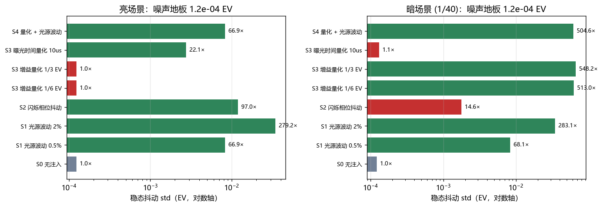

## 13. 时域滤波：在闭环里它不是免费午餐
这一节的结论**与最初的设想相反**，按实测数据写。

抖动源用 S1（0.5% 光源波动，上一节实测
68× 地板且严格线性）；
在第 36 帧做内容切换，一条序列同时产出抖动与延迟。

| 配置 | 稳态曝光抖动 std (EV) | 画面抖动 std (EV) | 重收敛帧数 | 帕累托 |
|---|---|---|---|---|
| 无滤波 (alpha=1) | 0.00757 | 0.01076 | 6 |  |
| 固定 alpha=0.5（检测器关） | 0.00743 | 0.01382 | 11 |  |
| 固定 alpha=0.5 + 检测器 | 0.00743 | 0.01382 | 6 |  |
| 固定 alpha=0.4（检测器关） | 0.00843 | 0.01625 | 17 |  |
| 固定 alpha=0.4 + 检测器 | 0.00843 | 0.01625 | 6 |  |
| 固定 alpha=0.2（检测器关） | 0.21028 | 0.21492 | 36 |  |
| 固定 alpha=0.1（检测器关） | 1.58721 | 1.60351 | **未收敛** |  |
| 自适应 alpha（检测器关） | 0.00619 | 0.01365 | 6 | ★ |
| 自适应 alpha + 检测器 | 0.00619 | 0.01365 | 6 | ★ |

**一、时域滤波并没有降低曝光抖动，开太狠反而失稳。**
固定 alpha 的曝光抖动全都比不滤波（0.00757）**更差**；
alpha=0.2 时涨到 0.210 EV，
alpha=0.1 直接**未收敛**（曝光抖动 1.59 EV）。
根因是这套 AE 是**变步长**的（大误差时 d=0.9，过曝补偿还能把它推到 1.0）——
慢滤波的相位滞后叠加这个大环路增益，把闭环推向振荡。
所以"滤波开大一点更稳"是错的：**滤波强度存在稳定边界**。

**二、真正有价值的是场景切换检测器。** 同一滤波强度下成对比较：

| 稳态滤波 | 检测器关 | 检测器开 | 曝光抖动 |
|---|---|---|---|
| alpha=0.5 | 11 帧 | **6 帧** | 两行相同（0.00743） |
| alpha=0.4 | 17 帧 | **6 帧** | 两行相同（0.00843） |

延迟直降，**抖动分毫不变** —— 这正是检测器存在的理由：
它买到的是"切换瞬间立刻松手"，不牺牲稳态平滑。

**三、自适应 alpha 规则下检测器是冗余的**（两行数值完全相同）——
因为大误差本来就触发 fast。如实记录，不硬凑它有用。
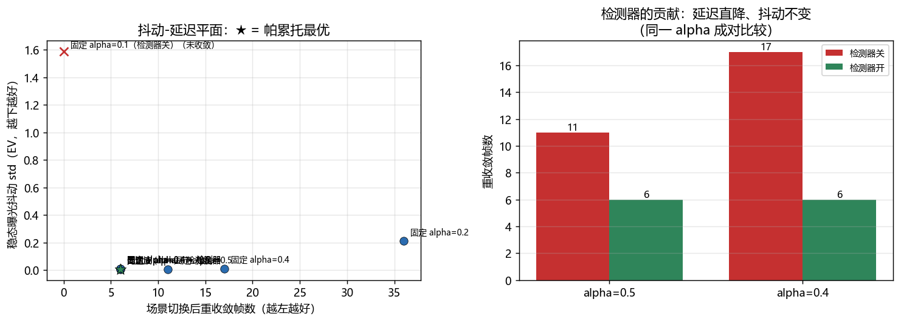
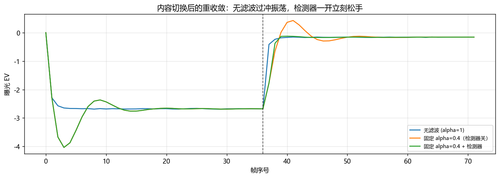

## 14. 场景切换检测与 AWB 时域稳定
**检测器怎么做的。** 三个逐帧信号投票（至少 2 票），全部从画面现算，不依赖真值：

- `d_metric_ev`：**曝光归一化**后的测光量跳变。归一化是关键 —— 去掉它，
  AE 自己收敛 3 EV 就会被当成一次场景切换。
- `texture_ratio`：结构信号（带通能量占比）比值。对**亮度整体缩放严格不变**。
- `hist_dist`：曝光归一化亮度直方图的距离。

**门限由数据定，不靠猜。** 静止条件取最坏值、切换事件取最小值，门限落在中间：

| 信号 | 门限 | 静止最坏 | 切换最小 | 分离度 | 门限裕度 |
|---|---|---|---|---|---|
| `d_metric_ev` | 0.350 | 0.0198 | 1.9993 | 101.0× | 5.71× |
| `texture_ratio` | 0.500 | 0.0242 | 0.1746 | 7.2× | 0.35× |
| `hist_dist` | 0.250 | 0.0410 | 0.6033 | 14.7× | 2.41× |

注意 `texture_ratio` 的门限裕度小于 1 —— **它在光照类事件上永远不会触发**。
真正撑住检出的是 `d_metric_ev` 和 `hist_dist`。但 `texture_ratio` 另有重任：
**只有它能区分"内容变了"和"光变了"**（`hist_dist` 对两类都敏感，拿它分类会把
光照变化误判成内容变化）。实测分类准确率 **0.667**
（4/6）。

| 事件 | seed | dM | hist | tex | 延迟(帧) | 判定类型 |
|---|---|---|---|---|---|---|
| 内容切换 natural→colorchart | 67 | 2.519 | 0.603 | 2.593 | 0 | content |
| 内容切换 natural→colorchart | 73 | 2.519 | 0.603 | 2.596 | 0 | content |
| 光照 ×4 | 67 | 2.177 | 0.738 | 0.551 | 0 | content |
| 光照 ×4 | 73 | 2.177 | 0.738 | 0.552 | 0 | content |
| 光照 ×1/4 | 67 | 1.999 | 0.738 | 0.175 | 0 | illumination |
| 光照 ×1/4 | 73 | 2.000 | 0.738 | 0.189 | 0 | illumination |
| 色温 5000K→3000K（等亮度） | 67 | 0.117 | 0.192 | 0.199 | 未检出 | none |
| 色温 5000K→3000K（等亮度） | 73 | 0.116 | 0.190 | 0.193 | 未检出 | none |

**整体表现：** 静止 10 组条件误触发 **0** 次
（含"让 AE 从 +3 EV 收敛"这条最要命的假阳性）；切换 8 次检出
6 次，检出的全部延迟为 0 帧。

**已知边界（如实写）：** 等亮度色温切换检出
0/2 —— 三个信号全都低于门限。
这套检测器测的是**亮度与内容**变化，不是**色度**变化。要覆盖它得另加色度信号。

**AWB 侧的对照：这里滤波是干净有效的。** 序列为 5000K 前 30 帧、
之后切到 3000K，曝光固定在 -0.17 EV：

| 配置 | 增益跳动 | 角度误差均值 | 误差 std | 重收敛 |
|---|---|---|---|---|
| 无时域滤波 | 0.00046 | 0.5440 | 0.0164 | 3 |
| alpha=0.9 | 0.00040 | 0.5439 | 0.0149 | 3 |
| alpha=0.5 | 0.00021 | 0.5435 | 0.0094 | 3 |
| alpha=0.2 | 0.00008 | 0.5438 | 0.0041 | 3 |

增益跳动降 **5.8 倍**，
而**角度误差均值几乎不变**（0.5440 →
0.5438）—— 这是"平滑不引入偏差"的正面证据。

**为什么 AWB 行而 AE 不行？** 结构不同：**AWB 是开环估计器**（逐帧独立、无反馈），
滤波只做平均；**AE 是闭环控制**，滤波改变的是环路动态。同一种滤波方法，放在
开环里是纯收益，放进闭环里就得先算稳定边界。
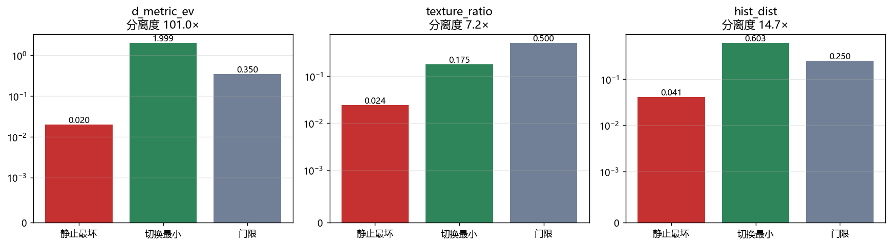
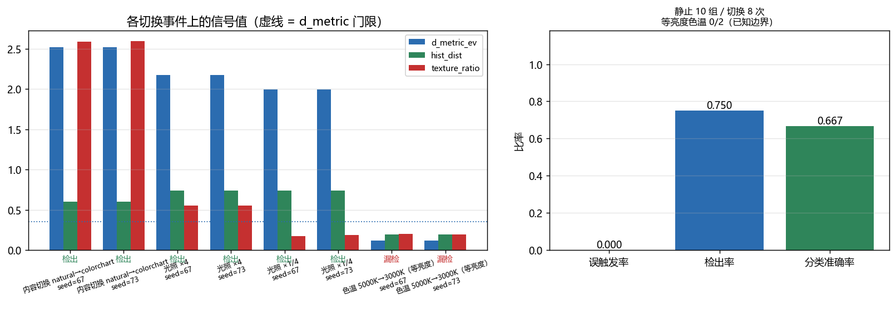
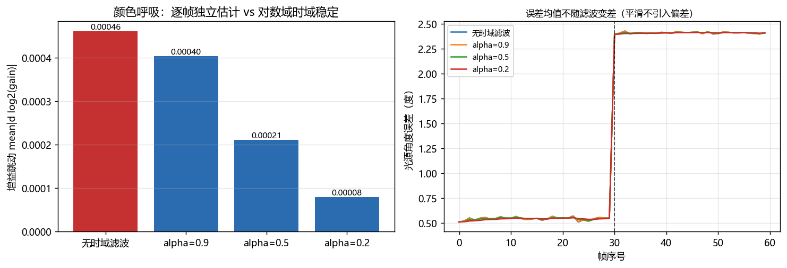

## 15. 画质指标：产品规格书上的那些数字
前面十节都是"哪个算法更好"的内部对比。这一节回答的是另一类问题：
**这台相机的画质到底是多少** —— MTF50、SNR、动态范围、色阴影。
这些才是画质调优的通用语言，也是能和别人对齐的口径。

**每一项测量都必须先自检**：用已知的输入去测，看能不能把真值反推回来。
不然只是一堆看着合理的数字。

### 11.1 斜边法 MTF（ISO 12233）

用已知 σ 的高斯 PSF 生成斜边，逐一对表：

| PSF σ (px) | 测出的边缘角度 | 实测 MTF50 | 理论 MTF50 | 偏差 | 曲线最大偏差 |
|---|---|---|---|---|---|
| 0.5 | 5.00 | 0.316 | 0.323 | -2.2% | 0.022 |
| 0.7 | 5.00 | 0.243 | 0.247 | -1.5% | 0.011 |
| 1.0 | 5.00 | 0.180 | 0.180 | -0.0% | 0.005 |
| 1.5 | 5.00 | 0.122 | 0.123 | -0.2% | 0.005 |
| 2.0 | 5.00 | 0.093 | 0.093 | +0.3% | 0.004 |
| 3.0 | 5.00 | 0.062 | 0.062 | +0.4% | 0.004 |
| 4.0 | 4.99 | 0.048 | 0.047 | +2.8% | 0.009 |

**结论**：七个模糊量下 MTF50 最大偏差 2.8%，
整条 MTF 曲线的最大偏差 0.022。测量链路可信。

实现过程中有两个坑值得记下来（都会让测量结果**系统性偏移**，但不报错）：
1. **归一化不能先减均值**：LSF 减掉均值会把直流分量压到 0，
   归一化就成了除以一个接近 0 的数，高频端直接炸到 1e15 量级。
2. **窗口宽度必须自适应，且不能用汉明窗**：窗口太窄会截断宽 LSF，
   按截断后的面积归一又把 MTF 整体抬高（实测 σ=3px 偏高 60%）；
   汉明窗整段衰减，等效于在空间域压缩 LSF、频谱展宽，实测抬高约 16%。
   换成**平顶 Tukey 窗 + 按 5σ 自适应定窗**后才压到 2% 以内。

### 11.2 AF 的评价函数在找什么，以及"锐化能提高 MTF 吗"

| | |
|---|---|
| MTF50 峰位 | 0.31（真合焦位置 0.35，峰顶平台跨相邻两格）|
| MTF50 与 Tenengrad 评价函数的相关系数 | 0.969 |

**结论一**：AF 的评价函数（高频能量）本质上是在用**梯度统计量**逼近物理清晰度 MTF ——
两者在整段镜头行程上的相关系数 0.969。这也解释了它为什么会有假峰和峰位抖动：
梯度统计量对噪声敏感，而 MTF 经过法方向分箱平均，噪声鲁棒得多。
高精度对焦要专门的评价函数硬件统计模块，原因就在这里。

**结论二（更值得说）**：线性域的 MTF50 峰值是 0.33，
走完整条 ISP（色调曲线 + USM 锐化）后在显示图上测是 0.49 ——
**锐化把 MTF 数字抬高了 1.29 倍，但信息量一点没增加。**

所以：
- 比较 MTF 必须在同一个域里比，跨域比较出来的数字没有意义
- 任何"锐化后解析力提升 X%"的说法，都要先问清楚是在哪个域测的
- SFR/MTF 的测量规范要求指定 gamma（ISO 12233 用的是特定编码域），根因就在这里

本项目的 MTF 全部在**线性域**测 —— 测的是成像系统本身的解析力，
不是"成像 + 后期"的合成结果。

### 11.3 噪声与光子转换曲线

|  | 实测 | 真值 | 偏差 |
|---|---|---|---|
| 转换增益 K | 3.0029 e-/DN | 2.9769 e-/DN | +0.9% |
| 读出噪声 | 2.021 e- | 1.8 e- | +12.3% |
| 加权 R² | 0.99916 |  |  |

**结论**：从"带噪声的图像"里能把传感器的转换增益反推到 +0.9%。
读出噪声偏高 +12% 不是误差 ——
量化噪声 1/12 DN² 折算到输入端是 0.86 e-，
与 1.8 e- 的读出噪声按平方和叠加恰好是 1.99 e-，
与实测吻合。**这说明测量不仅对，还能把误差来源解释清楚。**

拟合必须做两件事，否则结果会大幅偏掉（实测不做时 K 被反推成真值的 1.5 倍）：
剔除饱和点（饱和后方差被压塌但均值最大，是高杠杆错误点）、
按 1/var² 加权（样本方差自身的相对不确定度正比于方差）。

### 11.4 提高增益改善了什么

| 读出噪声模型 | 增益 | 暗噪声 (DN) | 折算到输入端 (e-) | 2 e- 信号的 SNR |
|---|---|---|---|---|
| ISO 无关 | 1× | 2.640 | 1.942 | -1.6 |
| ISO 无关 | 2× | 2.640 | 1.942 | -1.6 |
| ISO 无关 | 4× | 2.640 | 1.942 | -1.6 |
| ISO 无关 | 8× | 2.640 | 1.942 | -1.6 |
| ISO 无关 | 16× | 2.640 | 1.942 | -1.6 |
| 读出噪声后置 | 1× | 2.640 | 1.942 | -1.6 |
| 读出噪声后置 | 2× | 1.591 | 1.170 | +0.7 |
| 读出噪声后置 | 4× | 1.174 | 0.863 | +1.6 |
| 读出噪声后置 | 8× | 1.034 | 0.761 | +1.9 |
| 读出噪声后置 | 16× | 0.983 | 0.723 | +2.0 |

**结论**：这才是"增益有没有用"的完整答案，比前面"增益不改善 SNR"的说法更准确：
- 如果读出噪声折算在**输入端**（理想 ISO 无关传感器），提高增益毫无作用，
  暗噪声恒定 1.94 e-
- 真实传感器的读出噪声主要来自源跟随器与 ADC，折算在**输出端**，
  高增益把它按 1/增益压低：16× 增益下暗噪声从
  1.94 e- 降到
  0.72 e-
- **这就是 ISO 存在的意义**：它不改变光子噪声，但能压低暗部的读出噪声底

测量本身也有个条件：位深必须够。12bit 时量化噪声折算到输入端约 0.86 e-，
会盖住读出噪声从 1.8 e- 降到 0.11 e- 的过程，把效应整个埋掉 ——
所以这一节用的是 14bit。真实产线上测暗噪声也要确认量化噪声不成为瓶颈。

### 11.5 动态范围

|  |  |
|---|---|
| 实测 | 76.5 dB（12.7 档） |
| 理论（满阱 12000 e- / 读出噪声 1.8 e-） | 76.5 dB |
| ADC | 12 bit |

**结论**：动态范围由满阱与读出噪声之比决定，12bit 的 ADC
本身不构成瓶颈（量化噪声远低于读出噪声）。要提动态范围只能从
**增大满阱**（工艺、双转换增益）或**降低读出噪声**入手，加位深没用。

### 11.6 阴影：亮度均匀度与色阴影

| LSC 状态 | 亮度均匀度（四角/中心） | 色阴影 Δu'v'×1000 |
|---|---|---|
| 无 LSC | 0.683 | 2.12 |
| LSC 欠校正(0.7×) | 0.876 | 0.30 |
| LSC 正确 | 1.000 | 0.06 |
| LSC 过校正(1.25×) | 1.136 | 0.37 |

**结论**：
1. **色阴影必须单独量**。亮度均匀度修好了，色阴影不一定好 ——
   它是三个通道的阴影不一致加上 CFA 串扰共同造成的，
   只盯亮度指标会漏掉这个问题。
2. **过校正比欠校正更糟**。欠校正只是边角偏暗（0.876），
   过校正会把边角提亮到超过中心（1.138），而且色阴影也修不干净。
   这也是为什么 LSC 标定要跟着镜头走 —— 换镜头不重标，
   结果可能落在"过校正"这一侧。
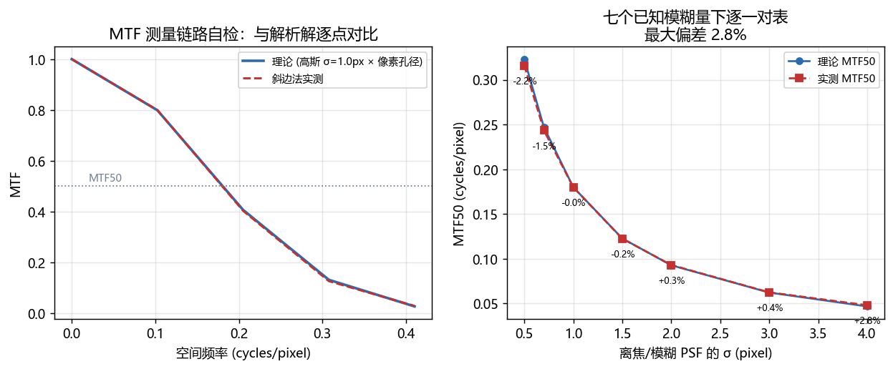
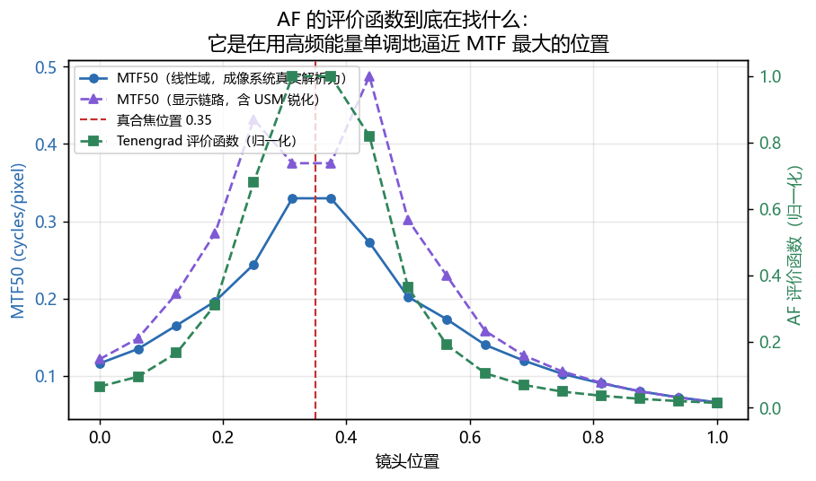
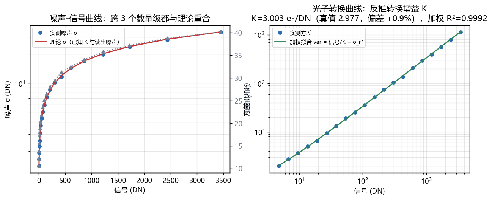
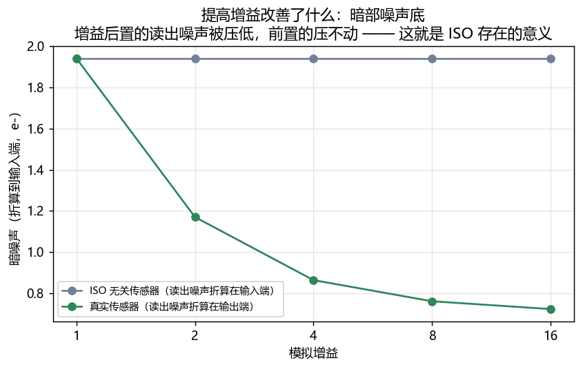
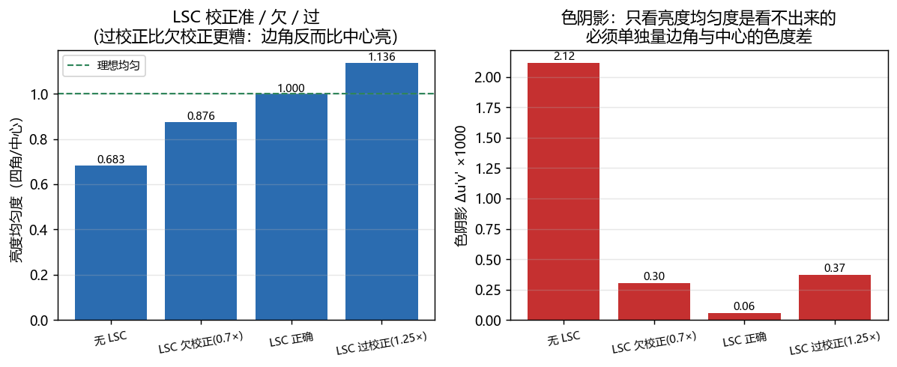

## 16. C++ 统计通路重写：加速来自算法，不是语言
把 AE 测光与 AWB 统计逐像素通路重写成 C++（`extern "C"` 共享库 + ctypes）。

**为什么不用 setuptools Extension / pybind11**：Windows 上的 CPython 是 MSVC 构建的，
而开发机只有 MinGW g++，MinGW 编译的扩展模块无法可靠链接。改成纯 C ABI 的共享库后，
两个工具链都能编、**不引入任何 pip 依赖**，而且这个库**脱离 Python 也能编能跑**
（`native/tests/native_main.cpp` 有 23 项不依赖 numpy 的解析自检）。

**环境（性能数字必须带环境才有意义）**：Windows-10-10.0.19045-SP0｜Python 3.10.14｜
numpy 1.26.4｜OpenCV 4.9.0｜gcc 8.1.0 | C++17 | release | Sep 19 2026 03:02:51

| 实现 | 中位数 µs | p10 | p90 | MAD |
|---|---|---|---|---|
| AWB 现状(Python) | 29024.8 | 28147.5 | 30681.2 | 549.1 |
| AWB 算法优化(Python) | 17306.2 | 16782.9 | 19122.9 | 423.9 |
| AWB C++ (double) | 1667.2 | 1619.1 | 1819.5 | 44.4 |
| AWB C++ (float32) | 1670.1 | 1620.2 | 1837.6 | 47.6 |
| AWB C++ (定点 Q16) | 3060.2 | 2908.0 | 3286.1 | 97.3 |
| AE 测光 现状(Python) | 850.2 | 808.6 | 989.3 | 34.9 |
| AE 测光 C++ (float32) | 379.2 | 353.2 | 438.3 | 13.1 |
| AE 全画面平均(Python) | 317.6 | 301.8 | 362.1 | 14.4 |
| AE 全画面平均 C++ | 329.0 | 322.7 | 340.9 | 2.7 |

ctypes 调用地板实测 **0.20 µs**，相对上面每个核都 < 5%，可以忽略。

**加速分解 —— 这张表才是这一节的重点：**

- 算法改进（Python→Python，只改算法）：**1.68×**
- 实现改进（算法不变，换 C++）：**10.36×**
- 总加速：**17.38×**

**「C++ 比 numpy 快 16 倍」是错的说法。** 看这一格就明白了：
在**没有任何算法差异**的模式上（全画面平均，两边都是一次求和），
换语言的收益是 **0.97×** —— 小于 1，也就是 **C 反而略慢**。
numpy 的 `mean()` 是 SIMD 归约，标量 double 循环赢不了它。

那 16 倍是从哪来的？**来自重写时顺手消除了结构性的浪费**：现状每帧做
5 次全帧布尔 gather、4 次 Sobel（其中 2 次完全重复）、3 次全帧 luma、
2 次全帧饱和度、4 次全帧开方，且无条件计算 4 个估计器。这些都不是"语言的锅"。
**准确的说法是：大头在算法与访存结构，语言本身几乎没有贡献。**

**等价性**（这一列才是"实现对了"的证据）：

| 场景 | n_valid 逐位相等 | gray_world | white_patch | gray_edge | shades_of_gray |
|---|---|---|---|---|---|
| color_chart | 是 | 1.0e-05 | 0.0e+00 | 7.7e-07 | 1.2e-05 |
| natural | 是 | 3.5e-06 | 0.0e+00 | 1.1e-06 | 8.6e-07 |
| uniform | 是 | 1.1e-05 | 0.0e+00 | 0.0e+00 | 2.3e-06 |

`white_patch` 的偏差是 **0.00e+00** —— 与**开发环境验证过的 numpy 1.26.4** 逐位相等。
做法是照抄 numpy 的 `virtual_index` 运算顺序、`_lerp` 的两分支写法、以及 `(b-a)` 必须在
float32 里减这三条细节。

⚠️ **这个「逐位」有版本边界**：CI 装的是 numpy 2.x，而 numpy 在 1.26 → 2.x 之间
**改过 quantile 的实现**（同一份输入下 p99 相差约 1 个 float32 ulp）。有意思的是
**C 侧的结果跨平台完全一致，变的是 numpy** —— 所以准确的说法是「复刻了开发时
验证过的那版语义」，不能无条件说「和 numpy 逐位相等」。
`gray_world` 的 ~2.8e-6 不是"我们算错了"：numpy 用 float32 pairwise、C 用 double
顺序累加，**差的是 numpy 自身的误差**，测试里还额外断言了"C 更接近 float64 精确值"。

**估算的算力占比**：AWB 统计占 33ms 帧预算的 5.01%；
按像素数线性外推，1080p 约 20041 µs、4K 约 80162 µs。
**这是外推不是实测**，忽略了缓存层次与带宽的变化，只能当量级估计。

**没做的**：没有实现一份"故意保留全部浪费的朴素 C"版本；没有面积/功耗/时序数据；
没有在真实 DSP/NPU 上跑过。本方案给的是算法与算术层面的可行性，不是 RTL 结论。
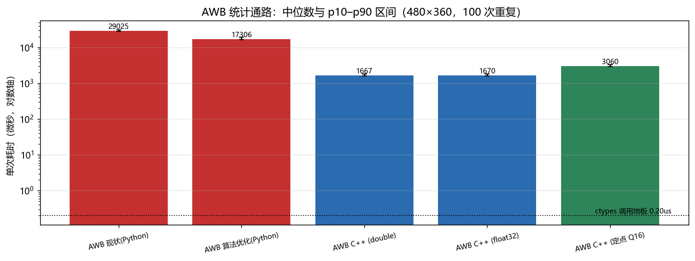
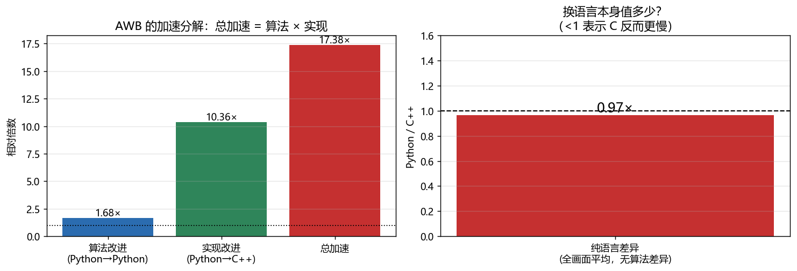

## 17. 定点化：误差有上界，不是拍脑袋的容差
把逐像素统计通路改成定点：**uint16 Q0.16 输入 + int64 累加 + 直方图分位数**。

**为什么 Q0.16**：`linear_pre_wb` 与 `linear_ccm` 都被 clip 在 [0,1]，Q0.16 满量程无浪费，
等价于"统计块吃 16bit 整数 luma"—— 这正是真实 ISP 的形态。
**为什么 int64 够**：4K 全图 Σ 也只有 5.4e11，evaluative 加权和约 1.9e16，
都远小于 2^63，**不需要分段移位**（那是 32 位 MCU 的妥协，代价是每行 0.5 LSB 的系统性偏差）。

**推导出的误差上界**（不是拟合出来的容差）：

- 均值类：像素量化 0.5 LSB + 权重 Q15 舍入 → 绝对上界 **1.8e-5**
- 分位数：直方图估计值与真值必然落在**同一个 bin** 内 → 绝对上界 = **一个 bin 宽**

| 场景 | 模式 | 浮点参考 | 定点 Q16 | 绝对差 | 折算 EV | 上界 | 合格 |
|---|---|---|---|---|---|---|---|
| color_chart | average | 0.180532 | 0.180532 | 1.08e-09 | 8.63e-09 | 1.8e-05 | 是 |
| color_chart | center | 0.178421 | 0.178421 | 1.50e-08 | 1.21e-07 | 1.8e-05 | 是 |
| color_chart | spot | 0.174130 | 0.174130 | 3.11e-09 | 2.58e-08 | 1.8e-05 | 是 |
| color_chart | evaluative | 0.179144 | 0.179144 | 4.95e-09 | 3.99e-08 | 1.8e-05 | 是 |
| color_chart | highlight_priority | 0.680489 | 0.680501 | 1.18e-05 | 2.51e-05 | 9.8e-04 | 是 |
| natural | average | 0.183009 | 0.183009 | 9.68e-09 | 7.63e-08 | 1.8e-05 | 是 |
| natural | center | 0.164122 | 0.164122 | 9.47e-08 | 8.32e-07 | 1.8e-05 | 是 |
| natural | spot | 0.084934 | 0.084934 | 1.98e-07 | 3.37e-06 | 1.8e-05 | 是 |
| natural | evaluative | 0.177618 | 0.177618 | 9.55e-09 | 7.76e-08 | 1.8e-05 | 是 |
| natural | highlight_priority | 0.478387 | 0.478420 | 3.28e-05 | 9.90e-05 | 9.8e-04 | 是 |
| uniform | average | 0.182070 | 0.182070 | 1.88e-09 | 1.49e-08 | 1.8e-05 | 是 |
| uniform | center | 0.182069 | 0.182069 | 4.68e-08 | 3.70e-07 | 1.8e-05 | 是 |
| uniform | spot | 0.182034 | 0.182034 | 8.11e-08 | 6.42e-07 | 1.8e-05 | 是 |
| uniform | evaluative | 0.182069 | 0.182069 | 1.06e-08 | 8.40e-08 | 1.8e-05 | 是 |
| uniform | highlight_priority | 0.190268 | 0.190297 | 2.82e-05 | 2.14e-04 | 9.8e-04 | 是 |

均值类折算到 EV 后比收敛阈值 0.02 EV **低约三个数量级**，分位数低约两个数量级。

**位宽与 bin 数的扫描 —— 这条给出一个可用的设计结论：**

| 输入位宽 | 全画面平均 | 高光优先（分位数） |
|---|---|---|
| 8 | 1.70e-06 | 6.89e-04 |
| 10 | 4.80e-08 | 1.66e-04 |
| 12 | 1.55e-07 | 2.68e-05 |
| 14 | 1.20e-08 | 1.10e-06 |
| 16 | 1.08e-09 | 1.18e-05 |

**10 位以上就没有收益了。** 因为分位数的瓶颈从"输入量化"转移到了"直方图 bin 宽"，
继续加位宽是在优化一个已经不是瓶颈的环节。要提精度只能加 bin 数：

| bin 数 | 一个 bin 宽 | 实测绝对误差 |
|---|---|---|
| 64 | 1.56e-02 | 3.39e-04 |
| 256 | 3.91e-03 | 3.54e-05 |
| 1024 | 9.77e-04 | 1.18e-05 |
| 4096 | 2.44e-04 | 1.85e-05 |

实测误差**始终压在 bin 宽之下**，与上界推导一致。

**AWB 侧的端到端**（融合数学仍是 Python 那份，所以这里量的是差异传导到决策有多大）：

| 场景 | n_valid 浮点/定点 | gray_world | white_patch | gains 相对差 | 角度误差差（度） |
|---|---|---|---|---|---|
| color_chart | 73647 / 73629 | 5.8e-05 | 6.8e-05 | 4.4e-05 | 0.0009 |
| natural | 82913 / 82913 | 1.1e-06 | 2.9e-04 | 2.2e-04 | 0.0054 |
| uniform | 172800 / 172800 | 2.5e-06 | 8.0e-05 | 1.3e-04 | 0.0052 |

角度误差差最大 **0.0054 度**，
而 AWB 本身的误差量级是 0.5~32 度 —— 定点化对既有结论没有影响。
`white_patch` 的 ~6.6e-4 也落在 bin 宽上界内。

**定点化的边界（明写）**：只定点化**逐像素统计通路**。融合权重、对数域几何平均、
CCT 约束、AE 控制律仍在 double —— 它们每帧只作用在 3~5 个数上，没有吞吐论证，
且含 `exp/log/pow`，定点化是另一场独立的误差分析。
**整条 ISP 的定点化（去马赛克、CCM 仍是浮点）明确不在范围内。**
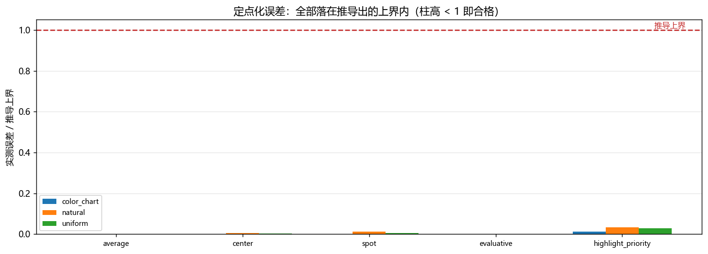
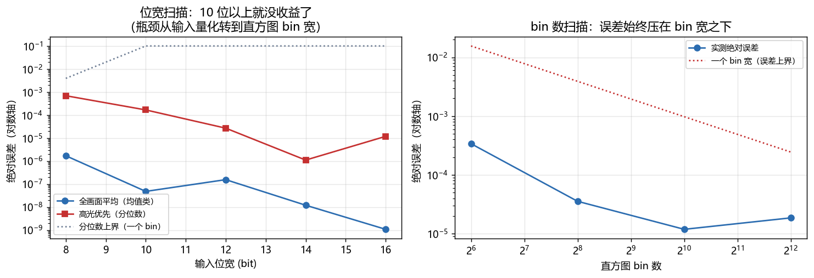

---
所有数字均由 `run_all.py` 一次性生成，可复现（固定随机种子）。